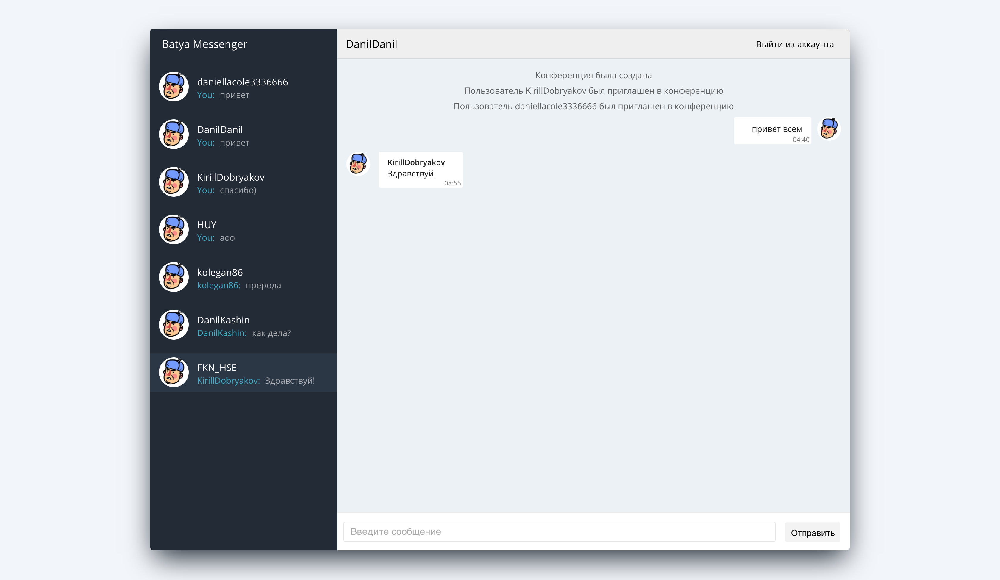

# The Web-Client of Batya Messenger



## Run application

```bash
npm install
npm start
```

## Documentation

Yeah, about API. 

## What did I understand when I did this project?

1. In this war, Facebook has long defeated.
2. If suddenly, you are offered an angular on the street, make a vision that you did not notice anything.
3. As I go on living, you answer yourself to a lot of questions, but here, you will get extra.
4. Google, Alphabet, and all who are involved in this, please stop.Á

